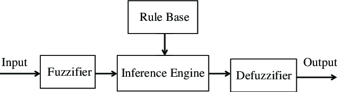
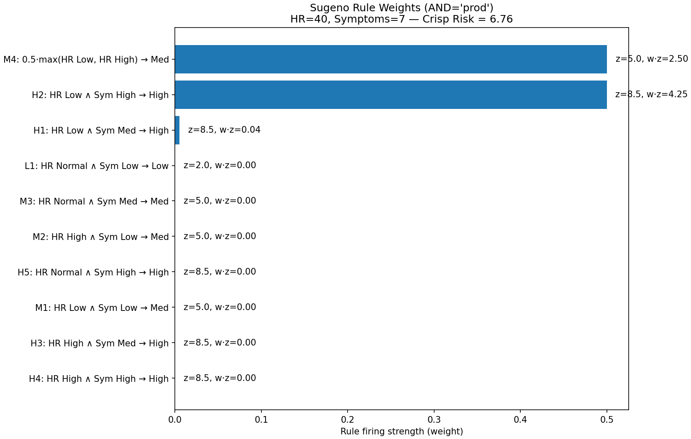
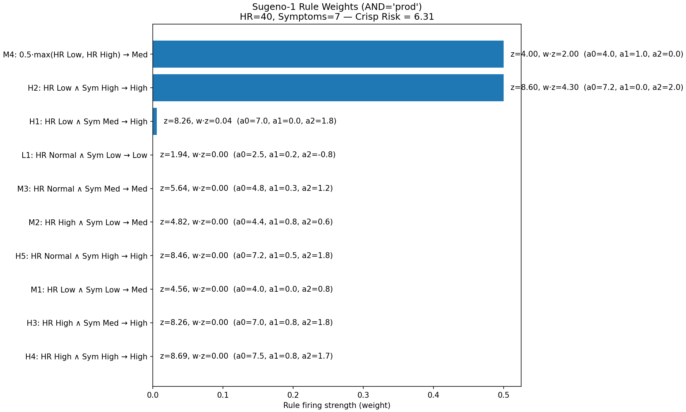
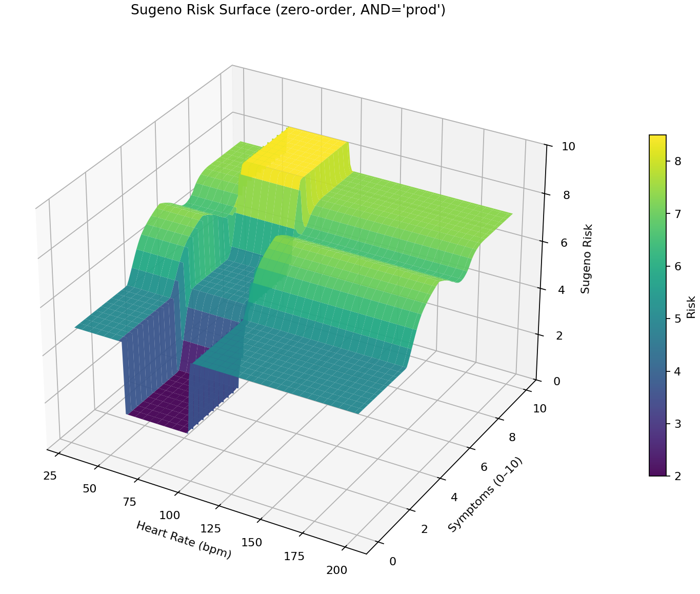
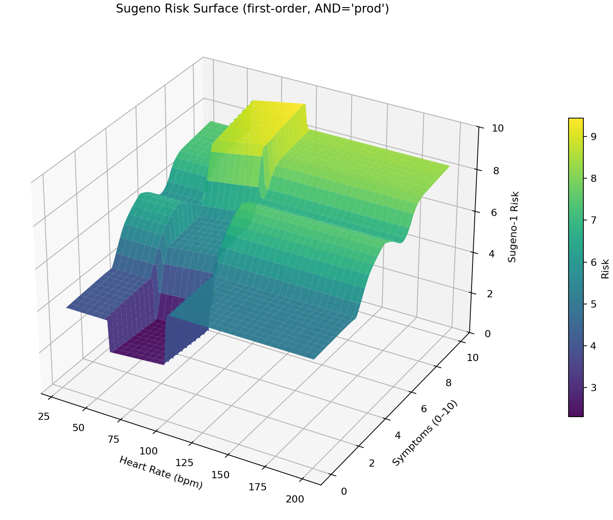

# Fuzzy Heart Rate — Visual Guide

## What is Fuzzy Logic?
Classical logic says a heart rate is either “normal” or “not.” Fuzzy logic says it can be **0.7 normal** and **0.2 high** at the same time.  
That nuance flows through **IF–THEN rules**, producing a **smooth** decision that reflects reality better than rigid thresholds.

1. **Inputs**: read numbers from sensors.  
2. **Fuzzification**: convert each number to degrees (0–1) for terms like *Low*, *Normal*, *High*.  
3. **Rules & Inference**: fire IF–THEN rules and combine their effects.  
4. **Defuzzification**: turn the fuzzy result back into **one output number**.

---

## What this project models
An **age-aware** fuzzy system that maps **Heart Rate (bpm)** and **Symptoms (0–10)** to a **Risk** score (0–10). It’s a learning/demo artifact, **not** a medical device.

- **Antecedents (inputs)**  
  - **Heart Rate (HR)**: 30–200 bpm. The *Normal* band is adjusted by age (and athlete flag).  
  - **Symptoms**: self-reported severity 0–10.

- **Consequent (output)**  
  - **Risk**: 0–10 (illustrative scale).

### Membership functions used
- **HR**  
  - *Low*: Z-shaped function that falls from 1 → 0 at the lower edge of the age-specific normal band.  
  - *Normal*: triangular, centered on the age-specific band.  
  - *High*: S-shaped function that rises from 0 → 1 at the upper edge of the band.
- **Symptoms**: low (Z), medium (triangle), high (S).  
- **Risk**: low / medium / high (triangles).

**Figure — Memberships (age-adjusted)**  

*Why these shapes?* Z/S functions give **soft shoulders** at the band edges; triangles keep the output interpretable and make the inference surface piecewise smooth.

---

## Rule base

<table>
  <thead>
    <tr>
      <th style="text-align:center;"></th>
      <th style="text-align:center;" colspan="3"><strong>Symptoms</strong></th>
    </tr>
    <tr>
      <th style="text-align:center;"><strong>HR</strong></th>
      <th style="text-align:center;">Low (0–3)</th>
      <th style="text-align:center;">Medium (3–7)</th>
      <th style="text-align:center;">High (≥7)</th>
    </tr>
  </thead>
  <tbody>
    <tr>
      <th style="text-align:center;">Low</th>
      <td style="text-align:center;">🟠 Medium <em>(M1)</em></td>
      <td style="text-align:center;">🔴 High <em>(H1)</em></td>
      <td style="text-align:center;">🔴 High <em>(H2)</em></td>
    </tr>
    <tr>
      <th style="text-align:center;">Normal</th>
      <td style="text-align:center;">🟢 Low <em>(L1)</em></td>
      <td style="text-align:center;">🟠 Medium <em>(M3)</em></td>
      <td style="text-align:center;">🔴 High <em>(H5)</em></td>
    </tr>
    <tr>
      <th style="text-align:center;">High</th>
      <td style="text-align:center;">🟠 Medium <em>(M2)</em></td>
      <td style="text-align:center;">🔴 High <em>(H3)</em></td>
      <td style="text-align:center;">🔴 High <em>(H4)</em></td>
    </tr>
  </tbody>
</table>

**Baseline (M4):** when HR is **extremely low or high**, add a small **Medium** risk even if symptoms are low (conservative safety net).

---

## Mamdani inference — how the engine works
This repository uses **Mamdani** (a.k.a. Max–Min) inference with **centroid** defuzzification.

1. **Fuzzification**: look up membership grades for the crisp inputs (e.g., HR=75 → μ_low, μ_normal, μ_high).  
2. **Rule evaluation**: combine antecedents with a t-norm (here **AND = min**, **OR = max**).  
3. **Implication**: each rule **clips** its consequent set by the rule’s firing strength (**min**).  
4. **Aggregation**: take the **max** across all clipped consequents to get one fuzzy output curve.  
5. **Defuzzification**: compute the **centroid (center-of-area, COA)** of that aggregated curve to produce the crisp risk.  
   *Other methods:* **MOM** (mean of maxima), **SOM/LOM** (smallest/largest of maxima), **Bisector**, etc.  
   See: <https://en.wikipedia.org/wiki/Defuzzification>

**Figure — One Mamdani pass (aggregated output + centroid)**  

**Notes**
- With overlapping membership functions and **centroid**, the crisp mapping is **continuous** but can have **kinks** where different rules dominate (continuous-but-not-smooth).  
- True discontinuities appear more often with MOM/SOM/LOM or with non-overlapping/gapped sets.

---

## Sugeno (Takagi–Sugeno–Kang) — why & how we use it
A Sugeno system makes each rule output a **number**, then blends those numbers with a **weighted average**.  
Great when different symptoms should carry **different importance** or when you want parameters that can be **learned**.

### Two flavors used here
- **Zero-order (constant):** each rule returns a fixed number (e.g., **2 / 5 / 8.5** via `SUGENO_Z`).  
  Crisp result = weighted average of those constants.
- **First-order (linear):** each rule returns  
  `z = a0 + a1·hrn + a2·symn`, where `hrn` and `symn` are **normalized** inputs (`hrn` wrt age band, `symn` in [0,1]).  
  Coefficients (see `DEFAULT_TSK1_COEFFS`) encode **importance** of HR and Symptoms for each rule.

### How it contrasts with Mamdani

| Aspect | **Mamdani** | **Sugeno (0th / 1st)** |
|---|---|---|
| Rule output | Fuzzy set (Low/Med/High) | **Number** (constant or linear) |
| Combine rules | Max of clipped fuzzy sets | **Weighted average** of numbers |
| Final crisp value | **Defuzzify** (e.g., centroid) | **Already crisp** (no defuzz) |
| Smoothness | Piecewise-smooth; has **kinks** | **Very smooth**; few kinks/plateaus |
| Personalization | Harder to fit from data | **Easy to learn** coefficients (e.g., ANFIS) |
| Interpretability | Natural “IF HR High THEN Risk High” | Math-transparent via coefficients |

> **t-norm:** In both Sugeno variants we use **AND = product** by default (`and_op="prod"`), which tends to give smoother behavior than `min`.

### Rule influence at a single point (Sugeno)
*(Example: HR = 40, Symptoms = 7)*

- Shows which rules **fire strongest** (bar = weight), with annotations for each rule’s output (`z`) and contribution (`w·z`).  
- Makes the decision path transparent—e.g., is the output driven by **“HR Low & Symptoms High → High”** or by **“Normal & Medium”**?

**Zero-order weights**  

**First-order weights**  
*(linear consequents; coefficients shown in labels)*  

---

## Tuning guide (what to adjust)
- **Age & athlete profile**: changes the HR normal band (affects fuzzification).  
- **MF steepness**: widen/narrow Z/S shoulders (±12 bpm here). Softer shoulders = gentler transitions.  
- **Symptoms thresholds**: shift **3/5/7** to change when Med/High kick in.  
- **Rule weights/targets**: in zero-order change `SUGENO_Z`; in first-order edit `DEFAULT_TSK1_COEFFS` to emphasize **red-flag symptoms** or HR extremes.  
- **t-norm**: try `and_op="min"` for crisper gating vs `"prod"` for smoother blending.  
- **Defuzzification** (Mamdani only): centroid is smooth/robust; MOM/SOM/LOM create more abrupt behavior.

---

## Sanity checks (expected outputs)
- **HR=75, Symptoms=1** → low risk (valley).  
- **HR=40, Symptoms=7** → high risk (top plateau).  
- **HR=110, Symptoms=2** → medium-ish (edge ledge).

---

## Global behavior — 3D risk surfaces *(last)*
Evaluate each system over an HR×Symptoms grid:

**Mamdani (centroid)**  

**Sugeno (zero-order)**  

**Sugeno (first-order / linear)**  

*How to read:*  
- **Valley** at normal HR + low symptoms → low risk.  
- **Ridge** as symptoms rise to medium.  
- **High roof** when symptoms are high; roof width depends on thresholds, rule targets (0-order), or coefficients (1st-order).  
- **Ledges** at HR extremes even with few symptoms (safety baseline).
