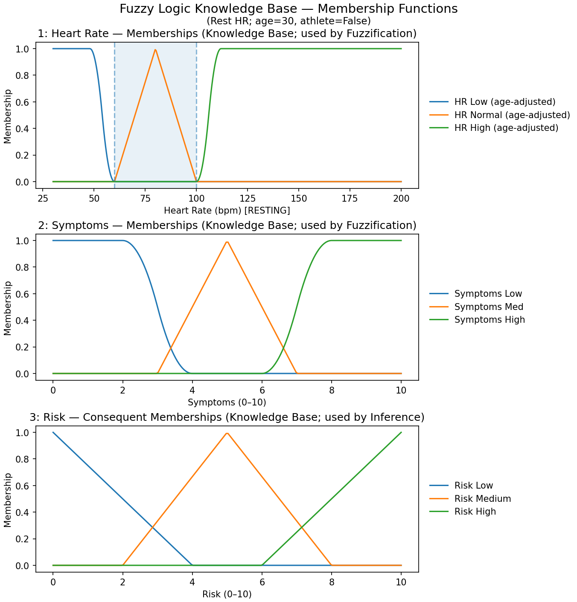
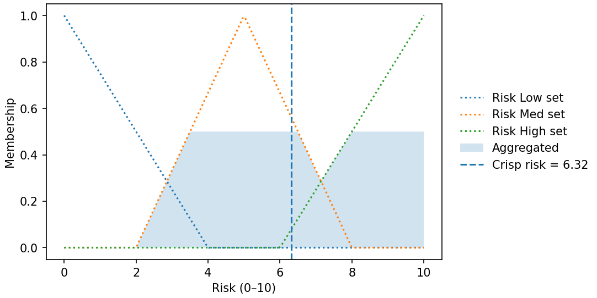
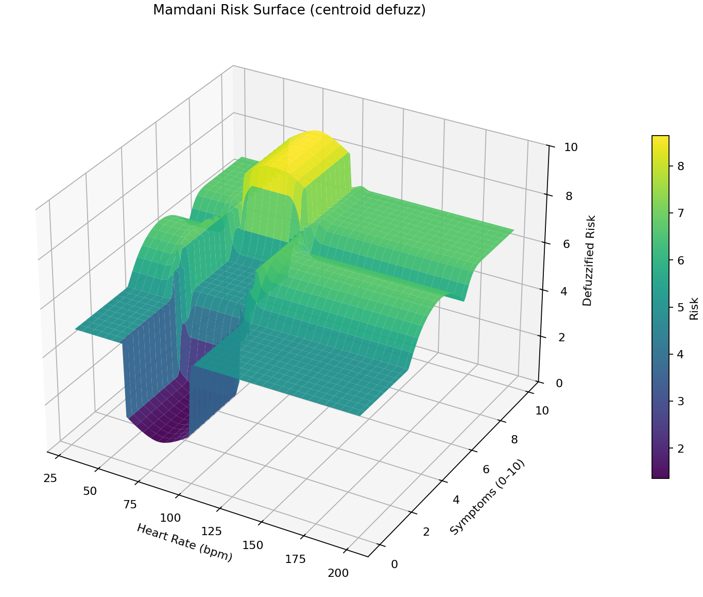

# Fuzzy Heart Rate — Visual Guide

## What is Fuzzy Logic?
Classical logic says a heart rate is either “normal” or “not.” Fuzzy logic says it can be **0.7 normal** and **0.2 high** at the same time.  
That nuance flows through **IF–THEN rules**, producing a **smooth** decision that reflects reality better than rigid thresholds.

1. **Inputs**: read numbers from sensors.  
2. **Fuzzification**: convert each number to degrees (0–1) for terms like *Low*, *Normal*, *High*.  
3. **Rules & Inference**: fire IF–THEN rules and combine their effects.  
4. **Defuzzification**: turn the fuzzy result back into **one output number**.

---

## What this project models
An **age-aware** fuzzy system that maps **Heart Rate (bpm)** and **Symptoms (0–10)** to a **Risk** score (0–10). It’s a learning/demo artifact, **not** a medical device.

- **Antecedents (inputs)**  
  - **Heart Rate (HR)**: 30–200 bpm. The *Normal* band is adjusted from the helper function based on age (and athlete flag).  
  - **Symptoms**: self-reported severity 0–10.

- **Consequent (output)**  
  - **Risk**: 0–10 (illustrative scale).

### Membership functions used
- **HR**:  
  - *Low*: Z-shaped function that falls from 1 → 0 at the lower edge of the age-specific normal band.  
  - *Normal*: triangular, centered on the age-specific band.  
  - *High*: S-shaped function that rises from 0 → 1 at the upper edge of the band.
- **Symptoms**: low (Z), medium (triangle), high (S).
- **Risk**: low / medium / high (triangles).

**Figure — Memberships (age-adjusted)**  

Why these shapes? Z/S functions give **soft shoulders** at the band edges; triangles keep the output interpretable and make the inference surface piecewise smooth.

---

## Rule base — pretty & compact

### Color key
  

### A. Matrix view (what each combo means)

| **HR \ Symptoms** | **Low (0–3)** | **Medium (3–7)** | **High (≥7)** |
|---|---|---|---|
| **Low**    |  M1 |  H1 |  H2 |
| **Normal** |  L1 |  M3 |  H5 |
| **High**   |  M2 |  H3 |  H4 |

**Baseline (M4)**:   
*Extremely* low or high HR adds a **gentle medium** risk even if symptoms are low (a conservative safety net).

### B. Human‑readable cards

> #### 🔴 High risk (H1–H5)
> - H1: HR **low** & Symptoms **medium**  
> - H2: HR **low** & Symptoms **high**  
> - H3: HR **high** & Symptoms **medium**  
> - H4: HR **high** & Symptoms **high**  
> - H5: HR **normal** & Symptoms **high** *(symptoms dominate)*

> #### 🟠 Medium risk (M1–M4)
> - M1: HR **low** & Symptoms **low** *(monitor)*  
> - M2: HR **high** & Symptoms **low**  
> - M3: HR **normal** & Symptoms **medium**  
> - M4: **Extremely low or high HR** → adds a small medium risk *(half‑weight baseline)*

> #### 🟢 Low risk (L1)
> - L1: HR **normal** & Symptoms **low**

## Mamdani inference — how the engine works
This repository uses **Mamdani** (a.k.a. Max–Min) inference with **centroid** defuzzification.

1. **Fuzzification**: look up membership grades for the crisp inputs (e.g., HR=75 → μ_low, μ_normal, μ_high).  
2. **Rule evaluation**: combine antecedents with a **t-norm**; here **AND = min**, **OR = max**.  
3. **Implication**: each rule **clips** its consequent set by the rule’s firing strength (**min**).  
4. **Aggregation**: take the **max** across all clipped consequents to get one fuzzy output curve.  
5. **Defuzzification**: compute a **centroid** (center of area) of that aggregated curve to produce the crisp risk.

**Figure — One Mamdani pass (aggregated output + centroid)**  

Notes:
- With overlapping membership functions and the **centroid** method, the crisp mapping is **continuous** but can have **kinks** where different rules dominate.  
- True discontinuities more often appear with MOM/SOM/LOM defuzzification or with non-overlapping/gapped sets.

---

## Global behavior — the risk surface
We can evaluate the Mamdani system over a grid of inputs (HR × Symptoms) and defuzzify at each point. The result is a surface like this:

How to read it:
- **Valley** at **HR ≈ normal** and **Symptoms low** → “normal & low → low risk” dominates.  
- **Ridge** as symptoms move to **medium** → “normal & medium → medium risk”.  
- **Wide high plateau** once **Symptoms high** (≥7) → many **→ high** rules fire strongly.  
- **Side ledges** for **very low or very high HR** even with few symptoms → baseline “extremes carry some risk” rule.

---

## Tuning guide (what to adjust)
- **Age & athlete profile**: changes the HR normal band.  
- **MF steepness**: widen or narrow Z/S shoulders (±12 bpm in this demo). Softer shoulders reduce abrupt changes.  
- **Symptoms thresholds**: shift 3/5/7 to change when medium/high kick in.  
- **Rule weights**: lower the influence of the “→ High” rules to reduce the high plateau; or split *High* into *Moderately High* vs *Very High*.  
- **Defuzzification**: centroid is smooth and robust; MOM/SOM/LOM give more abrupt behavior.

---

## Sanity checks (expected outputs)
- **HR=75, Symptoms=1** → low risk (in the valley).  
- **HR=40, Symptoms=7** → high risk (on the top plateau).  
- **HR=110, Symptoms=2** → medium-ish (edge ledge).

---
